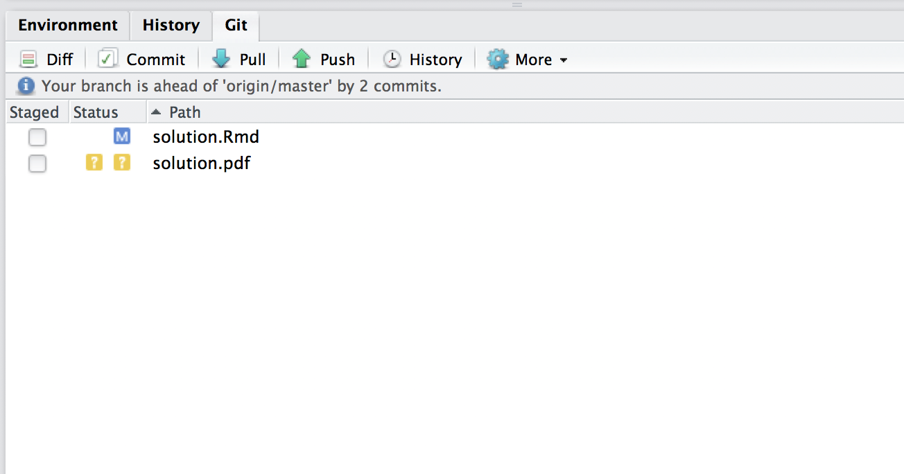

# 概要

この課題は 課題 `hw01` に対応する日本語版の課題です。両方を提出する必要はありませんが，両方の言語でレポートや論文を作成する可能性がある人はどちらもコンパイルできる（PDFを作成できる）ことを確認しておくとよいでしょう。中国語その他の言語での文書作成を希望していて，自分では解決できそうにない場合は相談してください。

## 目的 {-}

この課題の目的は以下の2つです。

1. 計算・執筆環境を整える
2. GitHub のワークフローに慣れる

この文書では **Rmarkdown** [@R-rmarkdown]，**knitr** [@R-knitr] および **bookdown** [@R-bookdown] の機能をたくさん使っています。みなさんが論文を書くときに参考にできるようにとの配慮です。今すぐすべてを理解する必要はありません。

## サマリー {-}

この課題の中で，

- レポジトリのクローンする
- 作業ブランチの作成する
- このPDFを著者を変更して再作成する
- 変更をコミットしてプルリクエストを送信する

ことを学びます。
 
# 準備

## GitHub アカウント {-}

GitHub アカウントを持っていない場合は作ってください。

- [GitHub](https://github.com/)

## ソフトウェア {-}

次のソフトウェアをインストールしてください。

- R 
- RStudio
- LaTeX ([texlive for Windows/Linux](https://www.tug.org/texlive/), 
  [MacTeX for macOS](https://tug.org/mactex/))
- [GitHub Desktop](https://desktop.github.com/)
- [Git for Windows](https://git-for-windows.github.io/) for Windows

インストールが完了したら次のステップに進んでください。

# 解答の手順

## Step 1. 課題レポジトリーをクローン（`clone`）する {-}

1. 担当教員かTAから受け取った招待用リンクをクリックする 
2. 課題への招待を受け入れると，GitHub Classroom があなたのためにレポジトリーを作ります
3. 2 でできたレポジトリーに進んでください
4. "Clone or download" と書かれた緑色のボタンをクリックし，"Open in Desktop" をクリック
   します。

GitHub Desktop アプリケーションが開きます。

## Step 2. 新しいブランチを作る {-}

ここで解答をはじめないでください！ GitHub Desktop のウインドウに図 \@ref(fig:master-branch) のような表示が見えると思います。これは，あなたが `master` ブランチにいることを示しています。`master` ブランチは，デフォルトブランチです。

```{r, master-branch, fig.align='center', fig.cap='master branch', echo=FALSE}
knitr::include_graphics("asset/images/master-branch.png")
```

新しいブランチを作り，分かりやすい名前を作りましょう。図 \@ref(fig:master-branch) 左側の枝分かれ様のボタンを押して，よい名前をつけてください。例えばここでは， "`solution`" としておきましょう。

そもそもブランチとは何かを簡単に説明しておきましょう。 ブランチは「開発ライン」に対応しています。 ときにはメインの開発ライン (`master`) から逸れて実験的な試みをやってみたいと思うかもしれません。そのようなときに新しいブランチを作ります。結果的に実験が失敗に終わったとしても，`master` に影響を与えることなく実験用ブランチを破棄できます。もし，実験が成功した場合には，メインの開発ラインに取り込む（`merge`） こともできます。ブランチはチームで作業するときに特に便利です。他のメンバーの開発環境を汚すことなく，自分が行った実験の成果を共有できます。

さて，図 \@ref(fig:solution-branch) のように変わったら完了です。

```{r, solution-branch, fig.align='center', fig.cap='solution branch', echo=FALSE}
knitr::include_graphics("asset/images/solution-branch.png")
```

## Step 3. 課題フォルダをRStudio で開く {-}

フォルダ (`hw01j`) をOSのファイルシステムで開いてください。 

- [Windows] ギアボタンをクリックして "Open in Explorer" をクリック
- [Mac] 左側に並んでいるレポジトリ名を2本指クリックして "Open in Finder" をクリック

ファイルシステムで `hw01.Rproj` ファイルをダブルクリックすると RStudio が起動します。

## Step 4. ソースファイルを開く {-}

RStudio の "Files" ペインの中に "solution.Rmd" を見つけてください。 
ファイル名をクリックすると，この文書のソースファイルが表示されます。


## Step 5. Knit する。エラーと仲良くなる {-}

エディターペインの上部にある "Knit" ボタン (図 \@ref(fig:knit-button)) をクリックしてください。はじめて Knit する場合には，必要なパッケージのインストールを行います。

```{r, knit-button, fig.align='center', fig.cap='Knit ボタン', echo=FALSE}

```

成功しましたか？ `solution.pdf` を開いて表示に問題がないことを確認してください。問題なければ次に進むことができます。 

もし，PDFが生成されていなくても諦めないでください。このようなことは日常茶飯事なので1つずつ解決していきましょう。心配いりません，プログラミングに熟練していくうちに出会うエラーは増えます（減るのではなく！）。エラーにもすぐに慣れます。

やるべきことは，エラーメッセージを注意深く読むことです。何が原因かを考えて見てください。ときには自分で解決できることもあるでしょうが，多くの場合は他の人に頼ることも必要でしょう。エラーメッセージをコピーして Google で検索しましょう。多くの場合，あなたが経験した問題を他の誰かも経験して，インターネットのどこかに書き留めてくれています。それでも自力解決が難しい場合には TA か担当教員に相談してください。 

**重要!!!** 「エラーがでてPDFができないんです。どうしたらいいですか？」というような曖昧な質問はやめましょう。問題解決には問題が発生した状況を詳しく知る必要があります。「○○を期待して，×× を試してみましたが，次のようなエラーが出てうまく行きません。エラー全文はこれです。解決方法はわかりますか？」という聞き方をしてください。

ひょっとしたらエラーはパッケージがインストールされていないからかもしれませんね。実はこの文書は幾つかのパッケージに依存しています。 **tidyverse** [@R-tidyverse] と **bookdown** [@R-bookdown] というパッケージを次のコマンドでインストールしてください。コンソールペインに次のコマンドを一行ずつ実行してください。

```{r, eval=FALSE}
install.packages("bookdown")
install.packages("tidyverse")
```

`install.packages("package_name")` はR でパッケージをインストールするための標準的な方法です。覚えておいてください。

## Step 6. ファイルを修正する {-}

出力されたPDFには氏名が書かれていません。Rmd ファイルのどの部分に氏名を入力すればよいかを見つけて，自分の名前に書き換えてください。

できたらファイルを保存して，もう一度 Knit してください。

## Step 7. コミット {-}

RStudio で Git ペインを探してください。 上で述べたとおりに修正して Knit すると，図 \@ref(fig:git-pane) のようになっているはずです。

```{r, git-pane, echo=FALSE, fig.align='center', fig.cap='Git ペイン', out.width="300px"}

```

`solution.Rmd` と `solution.pdf` の左側にあるチェックボックスをチェックして， これらのファイルをステージングエリアに追加してください。 これは `git-add` コマンドに対応しています^[https://www.atlassian.com/git/tutorials/saving-changes を参照]。

次に "Commit" ボタンをクリックしてください。新しいウインドウが開き，コミットメッセージを要求されます。 何を変更・追加したか，その目的について簡単に記載し，"Commit" ボタンをクリックします。これで変更を記録することができました。


## Step 8. Pull Request を送る {-}

GitHub Desktop アプリケーションに戻りましょう。課題レポジトリを左側のリストから探してください。当該レポジトリを開き，History タブを表示すると，あなたの行った修正を表示することができます。行うべき修正が緑（追加） と赤（削除）でハイライトされていることを確認してください。 

```{r, pull-request, fig.align='center', fig.cap='Pull Request', echo=FALSE}

```

問題なければ "Pull Request" ボタン（図 \@ref(fig:pull-request)）をクリックし，説明を書いて "Send Pull Request" ボタンをクリックします。

おめでとうございます。これで課題の提出が完了です。

この文書の残りの部分では，R とRmarkdown でできることの一部を紹介します。

# Example: R コードと出力を埋め込む

```{r}
library(tidyverse)
(iris_tbl <- as_data_frame(iris))
```

R のデータセットについては，生の出力はそれほど美しいものではありません。 `knitr::kable()` 関数を使うと，少し見栄えがよくなります。表\@ref(tab:iris-print) は次のコードによって出力されたものです。

```{r iris-print}
knitr::kable(head(iris_tbl, 10), caption = "Iris データセット")
```

次のコードは図\@ref(fig:iris) を生成します^[See http://stackoverflow.com/questions/38861041/knitr-rmarkdown-latex-how-to-cross-reference-figures-and-tables/38884378#38884378]。

```{r iris, fig.cap="Iris データ", fig.align='center', fig.width=4, fig.height=3}
ggplot(iris_tbl) + 
  geom_point(aes(x = Sepal.Length, y = Petal.Length, color = Species)) 
```


# Example: LaTeX を使った数式

LaTeX の構文を使って数式を書くことができます。 

\begin{equation}
f(x) = f(0) + \int_0^x f'(y) dy.  (\#eq:ftc)
\end{equation}


式 \@ref(eq:ftc) という風に式を相互参照することもできます（これは **bookdown** パッケージで追加されている拡張機能です）。ただし，LaTeX とは異なる構文を使う必要があります。詳しくは，
 [https://bookdown.org/yihui/bookdown/markdown-extensions-by-bookdown.html#equations](https://bookdown.org/yihui/bookdown/markdown-extensions-by-bookdown.html#equations) を参照。


# 参考文献 {-}

```{r include=FALSE}
# automatically create a bib database for R packages
knitr::write_bib(c(.packages(), 'bookdown', 'knitr', 'rmarkdown'), 'asset/bib/packages.bib')
```

